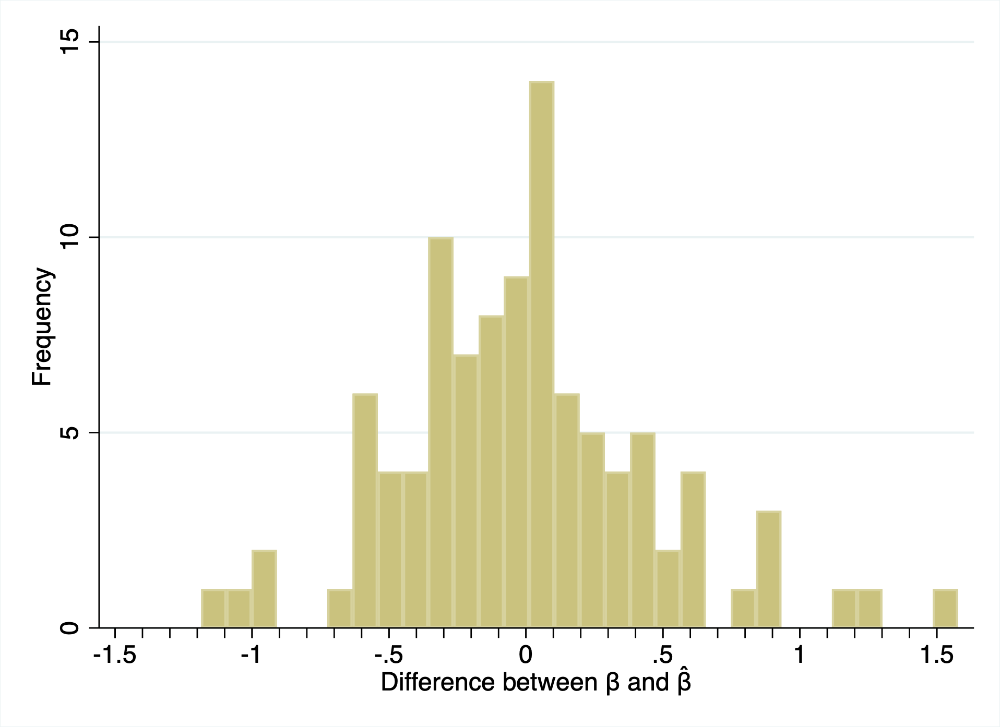
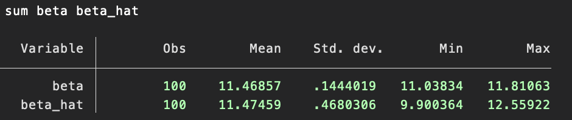

# Week 8 - Group 5
# Date: October 30, 2022

## Overview
We simulate data for our ECON 490 project studying DC charter schools. We use the DC system of admission by random lottery to charters as an instrument to estimate the impact of attending a charter of student test scores. We have 6 files, which have robust comments explaining each line of code.

## Group5_Week8_Simulation.do
This is our rclass program simulation. We generate 5,000 students who apply to the My DC Lottery for PK3. Each child has a designated local public school and chooses to apply to exactly one charter school at random. For schools where applicants exceeds capacity, a random lottery allocates seats. An admitted child chooses to attend the charter school if his/her test scores would be higher there than at the local public school. We then run an IV regression of a child's test score on a dummy variable for attending a charter, where admission to a charter serves as an instrument. The coefficient, beta hat, on the attend dummy equals the predicted impact of attending a charter. Next, we calculate the mean of the actual impact of attending a charter on student test scores relative to what his/her scores would have been at public school, which we call beta.

## Group5_Week8_Results.do
We loop through our simulation 100 times then import the data for beta and beta hat into Stata's memory. Then, we find the difference between beta and beta hat for each loop iteration. Next, we calculate a quasi cumulative mean variable called mean_difference, where each mean_difference[j] is the mean of the differences from loop 1 through loop j. Finally, we create some illustrative graphs and tables.

## Group5_Week8_Data.csv
This is a CSV of the data used to create the figures below. Please peruse at your pleasure.

## Histogram of difference between beta and beta hat
This shows the distribution of the difference beta minus beta hat for all 100 loops. We can see the mean is zero, which shows the difference between predicted IV estimator and the actual mean impact is usually around 0. This result suggests our IV estimator usually serves as an accurate estimate of the actual impact.

## Summary of beta and beta hat
This shows the summary statistics for bet and beta hat. The means are very, very close. However, the standard deviation of beta hat is substantially higher than that of beta. We hypothesize the result is caused by the IV estimator adjusting to outliers in the data, but we are unsure. We would appreciate any input from reviewers.

## Mean difference converges to 0
This is our coolest graph. We can see that, as the number of trials increases, the mean difference between beta and beta hat approaches 0. This result confirms that beta hat is a consistent estimator of the actual mean impact, beta.

![Mean_Difference_Converges_to_0.png] (Mean_Difference_Converges_to_0.png "Mean difference converges to 0")