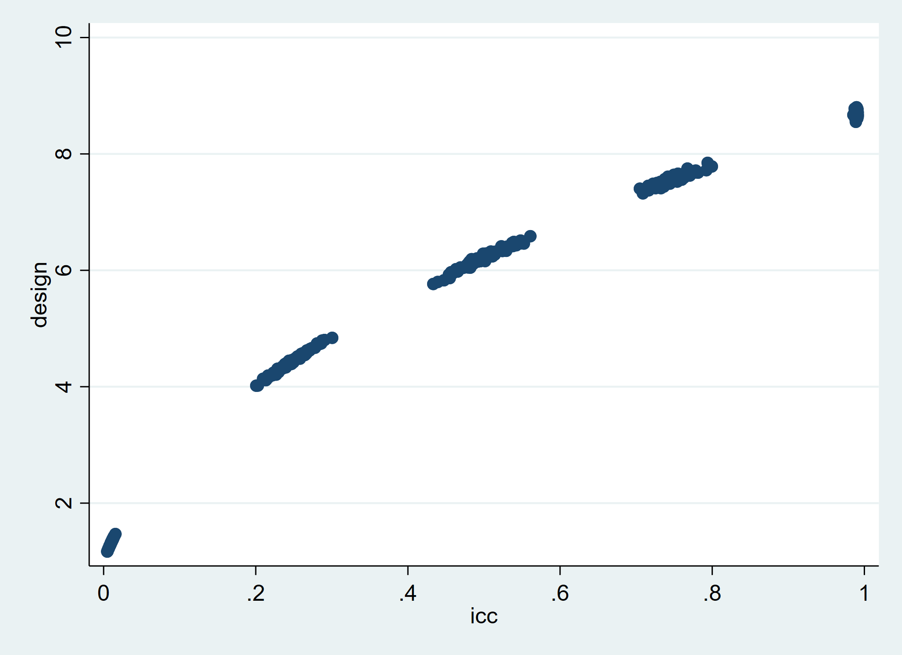

# WEEK 8 HW - Group 3

## Motivation

For this week's simulation assignment, we chose to illustrate the importance of intracluster correlation and the resulting design effect in clustered research designs.

### ICC

The intracluster correlation coefficient is a measure of how data point within clusters are related. The ICC is an important consideration when conducting power calculations and interpreting the results of data from a clustered study design. This is because similarity among the observations in clusters makes it more difficult to detect the true differences between study arms by reducing response variability. The ICC measures this similarity by comparing within cluster variance to between cluster variance.

Note that accounting for similarities among clustered subjects usually results in power loss. Thus, with higher levels of intracluster correlation, more observations are required to obtain the same minimal detectable effect.

A high icc ($\rho$) represents comparatively high "between clusters" variance.

If $\rho=1$, then all responses within a cluster are identical.

If $\rho=0$, then there is no correlation of responses within a cluster and the observations are functionally independent.

### Design Effect

During power calculations, the ICC and the average cluster size are used to calculate the design effect, which is included in the power calculation formula to adjust the required sample size for cluster sampling to make up for info lost from the clustered design. In essence, the design effect encapsulates the scalar increase in the MDE when a clustered design is adopted. A larger ICC, with the same average cluster size, produces a larger design effect, decreasing the minimal detectable effect.

## simulate.do Description

Our goal is to create simulated data across 200 clusters, which are schools in our case. In particular, we have defined an rclass program that uses the desired intracluster correlation coefficient ("ICC") as an input to the data generation process. Thus, we can input an expected ICC value and calculate the resulting design effect based on our simulated data. This is essential information for calculating our ultimate sample size.

To use the program, type [schools, rho(VALUE)] where "VALUE" is the ICC you want to look at. Notably, this must be between 0 and 1.

We then set the number of schools (clusters) to 200 and generate a way to refer to each of them.

By generating n_students and expanding, we are randomizing the number of students per school and essentially replacing each school observation with "n_students" many copies.

Then, we generate (student) ids to differentiate the observations in each cluster.

### Intracluster correlation in the data

Now, we are able to generate intracluster correlation in the data based on the desired rho. One of our assumptions for the sake of this simulation is that the total variance (variance between clusters + variance within clusters) = 1.

We generated test scores as our outcome variable. 

$$Y_{ij} = \mu + u_j + \epsilon_{ij}$$,
where $Y_{ij}$ is the outcome for student $i$ at school $j$, $u_j$ is a "school effect" (var between clusters), and $\epsilon_{ij}$ is the source of variance within clusters.

Notably $u_j$ is the same for all students within a school.

Also, test scores are capped at 100 and have a floor of 0.

We then generated some other characteristic variables that will serve as predictors in our model:
- number of absences: normally distributed with mean and stdev of 3, but with a floor of 0.
- number of disciplinary actions received: generated in such a way that students receive some sort of disciplinary action for every 3 absences. In addition, non-attendance related disciplinary actions come from a uniform distribution on the interval (0,3).
- body mass index or BMI (as a health measure): normal distribution with mean 20, stdev 2.
- whether a student received free/reduced-price lunch: generated from runiform(0,1), but rounded so that this is an indicator variable (only 0's and 1's).

A multilevel mixed-effects regression reveals how correlated scores are within the same school, conditional on the covariates. Thus, we are able to obtain the real ICC value in the simulated data, which will approach the inputted rho with infinite iterations.

Then, we estimate the design effect based on the ICC in the data and the average cluster size in the data.

## results.do Description

results.do sets the working directory, a randomization seed, and then loads the schools program defined in simulate.do. 

Then it runs the program with different ICC values (0.01, 0.25, 0.5, 0.75, and 0.99), running each 100 times and storing the results in the results matrix.

We store the columns from the results matrix as new variables that we use to create a scatter plot of the design effect and the ICC. 

Clearly, a larger ICC corresponds to a larger design effect, as we would expect from their theoretical relationship. This implies that the sample size has to be increased when there is high variance between clusters in order to achieve the same minimal detectable effect.

Then we export this scatterplot.

We also export a csv of the simulation's output.

