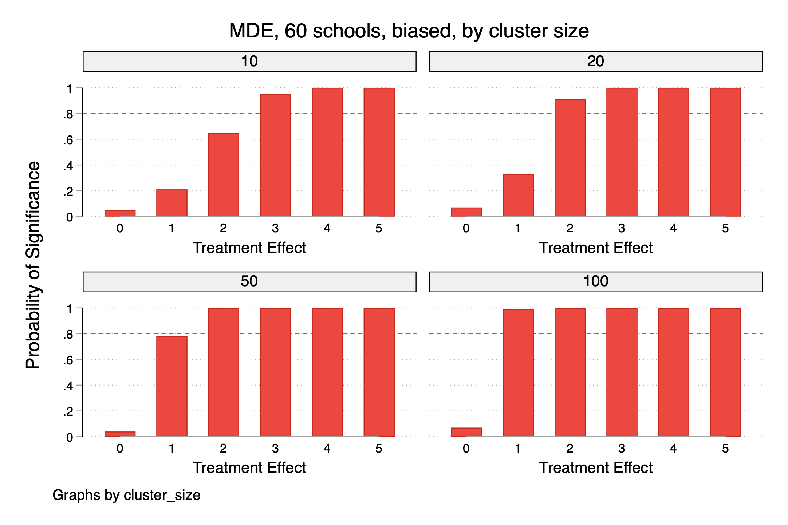
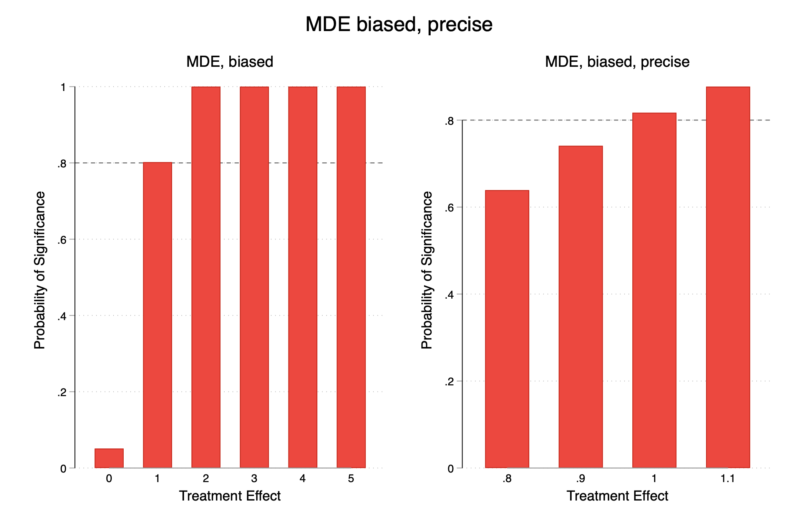
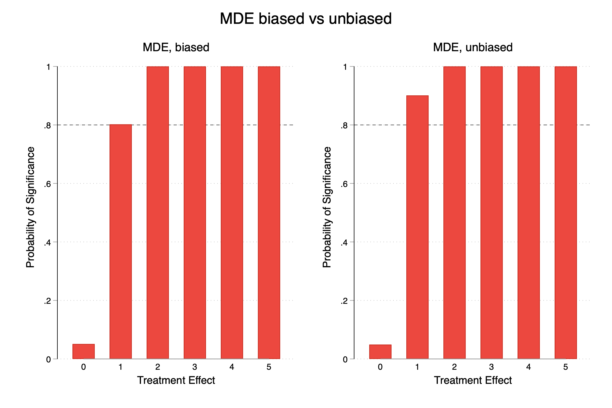

# Week 9 Group 4: Power Calculations

## Overview
We perform power calculations on our sample dataset of schools to find the minimum detectable effects (MDEs) of our treatment, while varying study parameters such as cluster size and cluster amount.

## Study design: projectdata_sim
The program projectdata_sim is an rclass program returning regression outputs. It takes in 5 user inputs as the study parameters. Calling the program could look something like this:

projectdata_sim [biased] [cluster size] [number of clusters] [treatment effect] [takeup rate]

Where
“biased” is a binary input, 1 for biased regression results, 0 for unbiased results. Biasedness relates to whether or not takeup rate is accounted for.
“cluster size” refers to the number of observations in each cluster. In this case, it would be the number of students in each school that we randomly select for data.
“number of clusters” refers to the number of clusters (schools) we will survey. We assign half the schools to the treatment group and the other half to the control group.
“treatment effect” refers to the expected effect of treatment.
“takeup rate” refers to the proportion of students in the treatment group who actually take up treatment.

For example, calling the program as:

projectdata_sim 1 50 100 5 0.8

Will run a simulation with 100 schools, selecting 50 students from each school, with an expected treatment effect of 5, and an expected takeup rate of 80%, not accounted for in the regression.

## Power
Firstly, we ran simulations of varying cluster sizes and cluster amount to determine the ideal cluster size for high power while maintaining some practicality.
We determined that 30 schools with 100 random students surveyed, or 60 schools with 50 random students surveyed would allow us to detect a minimum of around 1 percentage point on our mental health scale index. We expect the effect to be larger than 5, so this MDE works. We decided to go with 60 schools with 50 students surveyed each, as some schools may have less than 100 students in the year level. We ran our power calculations again, looking at treatment effects between 0.8 and 1.2 to find a more precise estimate for the MDE, and we found the MDE to be between 0.9 and 1.

We generated a csv, [mde_numberofschools_clustersize.csv] with the probability of significance of different treatment effects for varying numbers of schools and cluster sizes.

We generated 4 bar graphs showing the probability of significance of different treatment effects by sample size, with one graph showing results for 30 schools, one for 60 schools, one for 90 schools, and one for 120 schools. They are named [mde_bar_30_clustersize.png], [mde_bar_60_clustersize.png], [mde_bar_90_clustersize.png], and [mde_bar_120_clustersize.png].

We also generated a graph showing the probability of significance of different treatment effects using our selected cluster size and cluster sample, looking at treatment effects between 0 and 5 as well as treatment effects between 1 and 2. This is named [mde_biased_vs_biased_precise.png].

## Biasedness
Next, we ran simulations using our selected cluster size and cluster amount, once with bias and once without. We generated a graph showing the probability of significance of different treatment effects with and without bias, and found that the bias did not weaken our estimates much*. This is named “mde_biased_vs_unbiased.png”.

