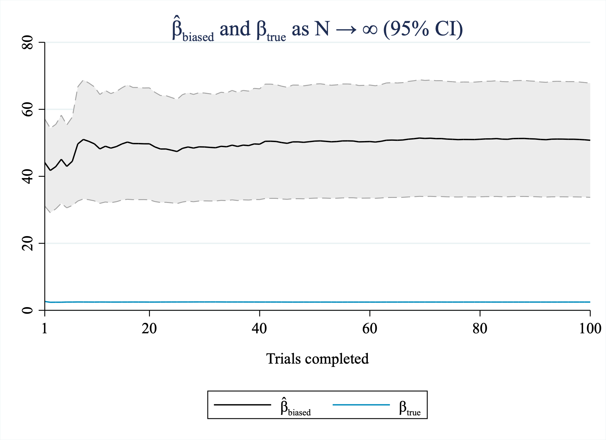

# Week 9 - Group 5
# Date: November 6, 2022

## Overview
We simulate data for our ECON 490 project studying DC charter schools. We use the DC system of admission by random lottery to charters as an instrument to estimate the impact of attending a charter of student test scores.

## estimation.do
This is our r-class program simulation. We generate 5,000 students who apply to the My DC Lottery for PK3. Each child has an innate ability and a designated local public school. The child applies to exactly one charter, which he/she chooses at random from amongst all charters with equal probability. Each school, public and charter, is randomly assigned a quality score. To reflect distributional differences, we draw public quality scores from a normal distribution with mean 100 and standard deviation 15, while charter scores are drawn from a normal distribution with the same standard deviation but mean of 105. We define the child's hypothetical test score attending a school as a Cobb-Douglas education production function of the child's innate ability and school quality. For schools where applicants exceeds capacity, a random lottery allocates seats. An admitted child chooses to attend the charter school if his/her test scores would be higher there than at the local public school. Children who lose the lottery and those whose test scores would be higher at their public schools choose to attend public schools.

We define the true average treatment effect (ATE) as the effect of attending charters on test scores across all 5,000 children in our sample. The true ATE is simply the mean of the individual treatment effects (ITE) across all children (i.e., the difference between each child's test score attending charter and his/her test score attending public). It is mathematically equivalent to say the true ATE = mean(ts_charter) - mean(ts_public). We estimate the biased ATE using an IV regression of test scores on a dummy variable for attending a charter, where admission to a charter serves as an instrument. The regression coefficient represents the ATE across all students *who actually attend charters*, i.e., students who were admitted *and* who choose to attend (because their test scores would be higher attending charters than public).

Why does the biased ATE differ from the true ATE? The bias is introduced by students who are admitted to charters but choose not to attend, as they would have lower test scores attending charters. As a result, the biased ATE is an overestimate of the true ATE. The latter reflects the impact of charter attendance across *all students*, whereas the biased ATE reflects the impact on the *compliers amongst the treated*, i.e., the admitted who *choose* to attend charters.

Why does this discussion matter? The biased ATE reflects a model specification pioneered by Angrist, Imbens, and Rubin (1996) that has become common the charter-school literature. However, it is imperative to underline how the bias in the ATE changes the appropriate takeaways from a study using this model. Namely, a sufficiently large and significant biased ATE should only serve as evidence for providing charters as an alternative *choice* to public schools. Such a biased ATE cannot, in good faith, be used to argue for *replacing* all public schools with charters.

## power-calculation.do
We loop through our simulation 100 times. (We will do more iterations for our final project, when we have more time.) For each iteration, we add a row to a matrix with columns for true ATE, biased ATE, the upper and lower bounds of the 95% confidence interval of the biased ATE, the mean test scores for public and private, and the standard deviations in test scores for public and private. We then imported these data into Stata's memory and cleaned up the variables.

Next, for each iteration (i.e., row), we calculate the minimum sample size at a 5% significance level and 0.8 power. These results are imputed into a new variable.

Thereafter, we create summary statistics for the true and biased ATEs as well as the minimum sample sizes, which are exported to a .csv file.

Lastly, we generate cumulative true ATEs, biased ATEs, and corresponding confidence intervals for the latter. For each row j, the cumulative variable is the mean of variable from row 1 to j. Using these new cumulative variables, we generate a graph showing the bias of the biased ATE as the sample size goes to infinity.

## Summary statistics: true ATEs, biased ATEs, and minimum sample sizes (MSNs)

The mean of the true ATE is *much* smaller than that of the biased ATE. The true ATE is, in theory, a point estimate, but we see variation in the empirical distribution of individual effects. We can confirm the statistically significant difference between the biased ATE and the true ATE by examining the sd column, which shows the standard errors for the biased ATE.

The table also shows the mean of the minimum sample size is 149 study subjects. There is some variation in this number across samples. However, even the maximum, 228, is far below the 5,000 students each simulation iteration models. For this reason, we can expect each iteration to have a 5% significance level and 0.8 power (or better).

These facts, combined with the consistency of our results, support the assertion that the biased ATE is, in fact, biased.

| variable | observations | mean | sd | min | max |
| :--- | ---: | ---: | ---: | ---: | ---: |
| True ATE | 100 | 2.461096437 | 0.157093987 | 1.997508049 | 2.842939138 |
| Biased ATE | 100 | 9.365381703 | 0.616475542 | 7.300717354 | 10.84226894 |
| MSN | 100 | 149.4 | 20.31469588 | 109 | 228 |

## Graph: Biased ATE is, in fact, biased

The graph shows how the biased ATE and the true ATE change as the number of trials (above called "iterations") approaches infinity. We can see both ATEs are, in fact, consistent, as they both appear to converge to finite values. However, the biased ATE is clearly different from the true ATE. We can confirm the statistical significance of this difference by inspecting the biased ATE's 95% confidence intervals, as depicted. the confidence intervals clearly show no overlap at point with the true ATE.

